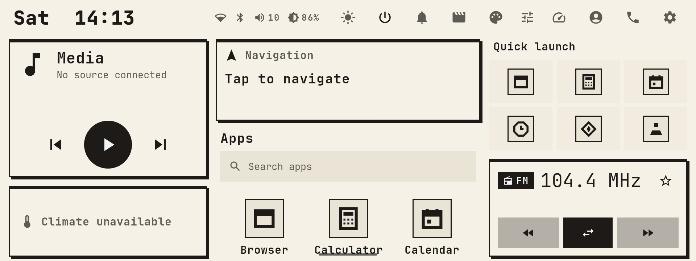

# device-reveng

[](LICENSE)
[](https://github.com/armeehn/device-reveng/actions/workflows/ci.yml)

An aftermarket Android head unit, taken apart and rebuilt in the open.

The unit is a Choiceway / AiNavi **GT6-EAU** (Qualcomm QCM6125, Android 13) fitted to a
2019 Toyota RAV4. This repository holds three things that grew out of one another:

| | What it is | State |
|---|---|---|
| [**Car Launcher**](launcher/) | A Kotlin/Compose HOME app that talks to the car: radio, media, climate readout, steering-wheel control, reverse camera. | Installable on the stock firmware today. |
| [**Riposte OS**](os/) | Our own system image for the unit: the stock vendor layer under an AOSP 14 base, our launcher and 28 apps, and our own process on the car's serial link instead of the vendor's. | 0.2 runs on the bench. Car checks pending. |
| [**The research**](HEAD_UNIT.md) | How the unit works: EDL backup, root, the MCU protocol, the camera path, every OEM app decompiled. | The reference the other two are built on. |



*Car Launcher on Riposte OS 0.2: FM 104.4 through our own MCU owner, volume read back from
the MCU, the app suite on the grid. Captured on the unit, on a bench, over Wi-Fi.*

---

## Read this first

- This is personal research on hardware we own, shared in case it helps other owners.
- Not affiliated with Choiceway, AiNavi, Toyota, Qualcomm or Magisk. Trademarks belong to
  their owners.
- No firmware, ROM, MCU images or decompiled vendor sources are redistributed here. Only
  findings and original code.
- Rooting or flashing can brick a unit. Flashing the wrong firmware or MCU image is the
  known way to kill these head units. Everything here is as-is, without warranty. The
  launcher itself needs no reflash; its car features need root on the stock firmware.

---

## Does this fit my unit?

Developed and tested against one configuration:

| | Value |
|---|---|
| Unit | AiNavi / Choiceway **GT6-EAU** (the XDA "Ainavi H6" family) |
| MCU | `RLC0_GT6E` |
| SoC | Qualcomm QCM6125 (`ro.board.platform=trinket`) |
| Stock OS | Android 13, API 33, kernel 4.14 |
| Screen | 1920 x 720 landscape at 240 dpi |
| Root | Magisk, bootloader unlocked |

Check yours:

```bash
adb shell getprop | grep -E "ro.product.(model|device)|ro.board.platform|persist.sys.mcu"
```

A **GT6-SE** (MCU `AT01_GT6SE`) is a different unit. The Android ROM is broadly shared
across QCM6125 units, but the MCU image is manufacturer-specific. Never flash another
vendor's MCU.

The launcher degrades instead of crashing on a unit it does not know: without root or the
vendor gateway it runs as a plain HOME launcher and the car panels report themselves
unavailable. A [hardware report](https://github.com/armeehn/device-reveng/issues/new?template=hardware_report.yml)
from another unit is useful, a negative one included.

---

## Car Launcher

### Install

Tagged builds are published to
[armeehn/carlauncher-releases](https://github.com/armeehn/carlauncher-releases/releases/latest),
a public, releases-only repository.

```bash
adb install -r carlauncher-<version>.apk
```

Press HOME and pick **Car Launcher**. The stock launcher stays installed; this registers as an
alternative home, so you can always switch back. Once running, the launcher updates itself
from the same repository (Settings → Updates).

### Set up

Open **Settings → Setup Doctor** inside the launcher. It checks root, the vendor gateway,
each special-access permission and the companion suite, and prints the exact `adb` or `su`
command for anything it finds. Start there rather than guessing.

Without root the launcher works, but reverse, steering-wheel and day/night events are
`signature`-protected broadcasts and stay out of reach; the vendor platform key is
[confirmed unobtainable](CUSTOM_ANDROID.md). With root it picks them up on its own.

> Upgrading from a build still named `com.reveng.carlauncher`? The application id changed to
> `com.ripostelabs.carlauncher`, which Android treats as a different app. Back up from the old
> launcher first (Settings → Backup & restore), install the new one and make it HOME, then
> uninstall the old one and restore the backup. Uninstalling the old launcher while it is
> your HOME leaves the unit with no launcher until a new one is set.

### What it does

Car integration goes through the vendor gateway over hand-written AIDL
([`CAR_API.md`](CAR_API.md)) on the stock firmware, and through our own MCU owner on
Riposte OS. The screens are the same either way.

- **Home**: dashboard, live car state, media, favourites, app drawer.
- **Motion awareness**: parked-only locks driven by real speed, so text-heavy screens
  stand down while moving.
- **Media and radio**: now playing, transport, presets, band switching.
- **Climate**: readout from the CAN/MCU stream. Writes are deliberately not shipped.
- **Steering wheel**: the whole app is drivable from the wheel.
- Notification shelf, on-screen keyboard, driver profiles, theming with an editor and
  import/export, Setup Doctor, backup/restore, and a CAN capture tool for further
  reverse engineering.

What is confirmed, guessed or untested on real hardware is kept honest in
[`launcher/README.md`](launcher/README.md) and [`STATUS.md`](STATUS.md).

### Build from source

JDK 17 and an Android SDK with platform 34. The Gradle wrapper pins the rest.

```bash
git clone https://github.com/armeehn/device-reveng.git
cd device-reveng/launcher
./gradlew :app:assembleDebug        # APK in launcher/app/build/outputs/apk/debug/
./gradlew test                      # JVM unit tests, no device needed
./gradlew :app:assembleRelease      # falls back to a debug key without RELEASE_* set
```

Clone in full: `versionCode` is the git commit count, and the build refuses a shallow clone
rather than stamping a wrong version. Release signing is described in
[`launcher/SIGNING.md`](launcher/SIGNING.md). The `rav4-apps` submodule holds the companion
apps and is not needed to build the launcher.

---

## Riposte OS

A flashable, reversible system image for the unit, built from a backup of its own firmware
by a repeatable pipeline. The vendor's hardware layer stays; everything above it is ours.

```
┌────────────────────────────────────────────────────────────┐
│ apps        Car Launcher (HOME, priv-app) + 28 suite apps   │  ours
├────────────────────────────────────────────────────────────┤
│ car layer   our process on the MCU serial link: car state,  │  ours (0.2)
│             keys, radio, volume, reverse, power             │
├────────────────────────────────────────────────────────────┤
│ system      AOSP 14 (a generic system image)                │  0.2
│             stock Android 13, re-mastered                   │  0.1
├────────────────────────────────────────────────────────────┤
│ vendor      HALs: GPU, panel, audio, Wi-Fi/BT, camera       │  kept as-is
└────────────────────────────────────────────────────────────┘
```

Two milestones exist. **0.1** keeps the stock framework and adds our apps beside the OEM
ones; it boots on the unit. **0.2** replaces the whole Android layer with an AOSP 14 GSI and
runs without a single OEM app: the launcher owns the serial link the vendor's gateway used
to own, and the suite talks to the launcher instead.

On the bench, 0.2 has these proven: boot, touch, gesture navigation, Wi-Fi, radio tuning and
seek on the real MCU, and volume from the MCU. The Bluetooth car-kit profiles are up, all 28
suite apps open clean, and Setup Doctor reads green. Reverse camera, wheel keys, headlamps
and a paired phone wait for the car.

The pipeline, the overlay, the car owner and the bench tools are documented in
[`os/README.md`](os/README.md); the flashing doors and rules in [`os/BENCH.md`](os/BENCH.md);
the acceptance list in [`os/ACCEPTANCE.md`](os/ACCEPTANCE.md). The same overlay is meant
to run on a head unit of our own design later, with the car layer behind one contract
([`os/CARHAL.md`](os/CARHAL.md)), so nothing depends on the vendor's software beyond what
its `/vendor` partition provides.

---

## The research

| Path | What |
|---|---|
| [`HEAD_UNIT.md`](HEAD_UNIT.md) | Root, EDL backup, camera and MCU findings, debloat |
| [`CAR_API.md`](CAR_API.md) | The vendor car-integration API |
| [`OEM_SYSTEM.md`](OEM_SYSTEM.md) | Every OEM app decompiled: contracts, keys, the replacement matrix |
| [`AIDL_ORDINALS.md`](AIDL_ORDINALS.md) | Transaction ordinals for the vendor AIDL |
| [`LAUNCHER_DESIGN.md`](LAUNCHER_DESIGN.md) | UI/UX spec and capability tiers |
| [`CUSTOMERUI_NOTES.md`](CUSTOMERUI_NOTES.md) | The stock launcher, decompiled |
| [`CUSTOM_ANDROID.md`](CUSTOM_ANDROID.md) | Custom-ROM feasibility; why the platform key is out |
| [`ZLINK_NATIVE_ANALYSIS.md`](ZLINK_NATIVE_ANALYSIS.md), [`ZLINK_REWRITE.md`](ZLINK_REWRITE.md), [`CARPLAY.md`](CARPLAY.md) | The projection stack: what Zlink is, and the specification for replacing it |
| [`can-integration/`](can-integration/) | CANable / LIN tapping plans and decoders |
| [`boot-speed/BOOT_SPEED.md`](boot-speed/BOOT_SPEED.md) | Cold-boot measurement and tuning |
| [`FINDINGS.md`](FINDINGS.md), [`STATUS.md`](STATUS.md) | Raw findings, live status |
| `backup.sh`, `root.sh`, `debloat.sh`, `camera-diag.sh` | Runbook scripts |

The runbook scripts expect the vendor files (Firehose loader, TWRP image, Magisk) in a
workspace directory, `~/rav4-headunit` by default:

```bash
RAV4_HOME=/path/to/workspace ./backup.sh
```

Each script checks its inputs first and says what is missing instead of failing halfway.
Sourcing the vendor files is on you; see [HEAD_UNIT.md](HEAD_UNIT.md#getting-the-vendor-files).
**Run `backup.sh` first, always.** It is read-only and it is the only thing between a bad
flash and a dead unit.

---

## Contributing

Bug reports from other GT6 owners are the most useful thing. [CONTRIBUTING.md](CONTRIBUTING.md)
in short: one feature per PR, never commit vendor material or device secrets, say which unit
you have. Security issues: [SECURITY.md](SECURITY.md).

## License

[Apache License 2.0](LICENSE). Third-party components and the vendor-interface carve-out
are listed in [NOTICE](NOTICE).
