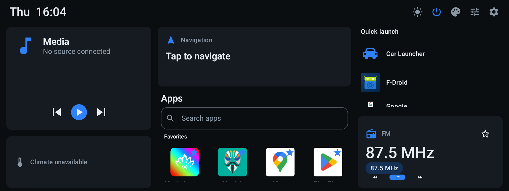

# device-reveng

[](LICENSE)
[](https://github.com/armeehn/device-reveng/actions/workflows/ci.yml)

Rooting, reverse-engineering and **replacing the software** on a Choiceway / AiNavi
**"GT6-EAU"** aftermarket Android 13 head unit (Qualcomm QCM6125), as fitted to a 2019
Toyota RAV4 (XA50).

Two things live here:

| | What it is |
|---|---|
| **[`launcher/`](launcher/)** | **Car Launcher** — a Kotlin/Compose HOME launcher that talks to the car. Installable today; see [Quick start](#quick-start). |
| **[`HEAD_UNIT.md`](HEAD_UNIT.md)** | The research: EDL backup, TWRP + Magisk root, the MCU serial protocol, the reverse-camera stack, debloat. |



---

## ⚠️ Read this first

- **This is personal research on hardware I own**, shared in case it helps other owners.
- **Not affiliated** with Choiceway, AiNavi, Toyota, Qualcomm or Magisk. All trademarks
  belong to their owners.
- **No firmware, ROM, MCU images or decompiled vendor sources are redistributed here.**
  Only findings and original code.
- **Rooting can brick your unit.** Flashing the wrong firmware or MCU image is a
  well-known way to permanently break these head units. Everything is provided as-is,
  with no warranty. The launcher itself does not require you to reflash anything — but
  it does need root for the car-integration features.

---

## Does this fit my unit?

Developed and tested against exactly one configuration:

| | Value |
|---|---|
| Unit | AiNavi / Choiceway **GT6-EAU** (XDA "Ainavi H6" family) |
| MCU | **`RLC0_GT6E`** |
| SoC | Qualcomm **QCM6125** (`ro.board.platform=trinket`) |
| OS | Android **13**, API 33 |
| Screen | 1920x720 landscape @240dpi |
| Root | Magisk (bootloader unlocked, SELinux permissive) |

Check yours:

```bash
adb shell getprop | grep -E "ro.product.(model|device)|ro.board.platform|persist.sys.mcu"
```

> **Variant matters.** A **GT6-SE** (MCU `AT01_GT6SE`) is a *different* unit. The Android
> ROM is broadly common across QCM6125 units, but the **MCU image is manufacturer-specific
> — never flash another vendor's MCU.**

The launcher degrades rather than crashes on a unit it does not recognise: without root
or the vendor gateway it still runs as a plain HOME launcher, and the car-specific panels
report themselves unavailable. If you try it on another unit, a
[hardware report](https://github.com/armeehn/device-reveng/issues/new?template=hardware_report.yml)
is genuinely useful — including a negative one.

---

## Quick start

### 1. Install the launcher

Tagged builds are published to
**[armeehn/carlauncher-releases](https://github.com/armeehn/carlauncher-releases/releases/latest)**
— a public, releases-only repo. Grab the latest APK there, then:

```bash
adb install -r carlauncher-<version>.apk
```

Once it is running, it can update itself: **Settings → Updates** checks that same
repo and installs the newer build, so this is a one-time side-load.

Press **HOME** and pick **Car Launcher**. The stock launcher
(`com.szchoiceway.customerui`) stays installed — this registers as an *alternative*
home, not a replacement, so you can always switch back.

### 2. Run the Setup Doctor

Open **Settings → Setup Doctor** inside the launcher. It checks root, the vendor
gateway, each special-access permission and the companion app suite, and prints the
exact `adb`/`su` command to fix anything it finds. Start there rather than guessing.

### 3. Optional: grant the extras

Without root the launcher works, but reverse/steering-wheel/day-night events and
SysVar writes are unreachable — those broadcasts are `signature`-protected and the
vendor platform key is [confirmed unobtainable](CUSTOM_ANDROID.md). With root it picks
them up automatically. Two grants are worth doing once:

```bash
adb shell pm grant com.ripostelabs.carlauncher android.permission.BLUETOOTH_CONNECT
adb shell appops set com.ripostelabs.carlauncher WRITE_SETTINGS allow
```

> **Upgrading from a build that was still `com.reveng.carlauncher`?** The application ID
> changed to `com.ripostelabs.carlauncher`. Android treats that as a different app, so the
> new APK installs *alongside* the old one rather than upgrading it, and it does **not**
> inherit the old settings. Migrate deliberately:
>
> ```bash
> # 1. In the old launcher: Settings -> Backup & restore -> Create backup.
> # 2. Copy it off the unit BEFORE uninstalling anything.
> adb pull /sdcard/Android/data/com.reveng.carlauncher/files/backups/
> # 3. Install the new APK and set it as HOME, THEN remove the old one.
> adb install -r carlauncher-<version>.apk
> adb uninstall com.reveng.carlauncher
> # 4. Push the backup into the new app and restore it from the same screen.
> adb push <backup-file> /sdcard/Android/data/com.ripostelabs.carlauncher/files/backups/
> ```
>
> Order matters: uninstalling the old launcher while it is your HOME app leaves the unit
> with no launcher until a new one is set.

---

## Build from source

Requires **JDK 17** and an **Android SDK** with platform 34. Nothing else — the Gradle
wrapper pins Gradle 8.9.

```bash
git clone https://github.com/armeehn/device-reveng.git
cd device-reveng/launcher
./gradlew :app:assembleDebug
```

APK lands in `launcher/app/build/outputs/apk/debug/`.

```bash
./gradlew test              # JVM unit tests — no device or emulator needed
./gradlew :app:lintRelease  # lint
./gradlew :app:assembleRelease
```

Two things that bite:

- **Clone in full.** `versionCode` is derived from git commit count, so a shallow clone
  would silently produce a wrong version. The build detects this and fails with an
  explicit message instead.
- **Release signing is optional.** With the `RELEASE_*` environment variables unset,
  `assembleRelease` falls back to the debug key so the build still works out of the box.
  A debug key is generated per machine, so APKs from two different machines will not
  install over each other. See [`launcher/SIGNING.md`](launcher/SIGNING.md).

The `rav4-apps` submodule holds 26 companion apps and is **not needed to build the
launcher**. A plain `git clone` skips it; that is fine.

---

## What the launcher does

Car integration goes through the vendor gateway `com.szchoiceway.eventcenter` over
hand-written AIDL ([`CAR_API.md`](CAR_API.md)), with a root fallback for the
`signature`-protected parts.

- **Home** — dashboard, live car state, media, favourites, app drawer.
- **Motion awareness** — parked-only locks driven by real speed, so text-heavy screens
  stand down while moving.
- **Media & radio** — now-playing, transport, presets, band switching.
- **Climate** — read-out from the CAN/MCU stream. Writes are deliberately not shipped.
- **Steering-wheel controls** — the whole app is drivable from the wheel.
- **Notification shelf**, on-screen **keyboard**, **driver profiles**, **theming** with
  an editor and import/export, **Setup Doctor**, **backup/restore**, and a **CAN capture**
  tool for further reverse engineering.

Honest status, including what is guessed and what is unvalidated on real hardware, is in
[`launcher/README.md`](launcher/README.md) and [`STATUS.md`](STATUS.md). The radar byte
layout in particular is **unconfirmed**.

---

## Repo map

| Path | What |
|---|---|
| [`launcher/`](launcher/) | The Car Launcher app (`:app` + `:carlib`) |
| [`HEAD_UNIT.md`](HEAD_UNIT.md) | Root, EDL backup, camera and MCU findings, debloat |
| [`CAR_API.md`](CAR_API.md) | The vendor car-integration API |
| [`OEM_SYSTEM.md`](OEM_SYSTEM.md) | Every OEM app decompiled: contracts, keys, and the replacement matrix |
| [`AIDL_ORDINALS.md`](AIDL_ORDINALS.md) | Transaction ordinals for the vendor AIDL |
| [`LAUNCHER_DESIGN.md`](LAUNCHER_DESIGN.md) | UI/UX spec and capability tiers |
| [`CUSTOMERUI_NOTES.md`](CUSTOMERUI_NOTES.md) | Stock launcher, decompiled — reference |
| [`CUSTOM_ANDROID.md`](CUSTOM_ANDROID.md) | Custom-ROM feasibility; why the platform key is out |
| [`ZLINK_NATIVE_ANALYSIS.md`](ZLINK_NATIVE_ANALYSIS.md) / [`CARPLAY.md`](CARPLAY.md) | Projection stack |
| [`can-integration/`](can-integration/) | CANable / LIN tapping plans and decoders |
| [`boot-speed/`](boot-speed/) | Boot-time measurement and tuning |
| [`FINDINGS.md`](FINDINGS.md), [`STATUS.md`](STATUS.md) | Raw findings, live status |
| `backup.sh`, `root.sh`, `debloat.sh`, `camera-diag.sh` | Runbook scripts |

### Runbook scripts

They expect the vendor files (Firehose loader, TWRP image, Magisk) in a workspace
directory. That defaults to `~/rav4-headunit` and is overridable:

```bash
RAV4_HOME=/path/to/workspace ./backup.sh
```

Each script checks its inputs up front and tells you exactly what is missing rather
than failing halfway through. Sourcing those files is on you — see
[HEAD_UNIT.md](HEAD_UNIT.md#getting-the-vendor-files).

**`backup.sh` first, always.** It is read-only and it is the only thing standing between
a bad flash and a dead unit.

---

## Contributing

Bug reports from other GT6 owners are the most useful thing. See
[CONTRIBUTING.md](CONTRIBUTING.md) — the short version is: one feature per PR, never
commit vendor material or device secrets, and say which unit you have.

Security issues: [SECURITY.md](SECURITY.md).

## License

[Apache License 2.0](LICENSE). Third-party components and the vendor-interface
carve-out are listed in [NOTICE](NOTICE).
